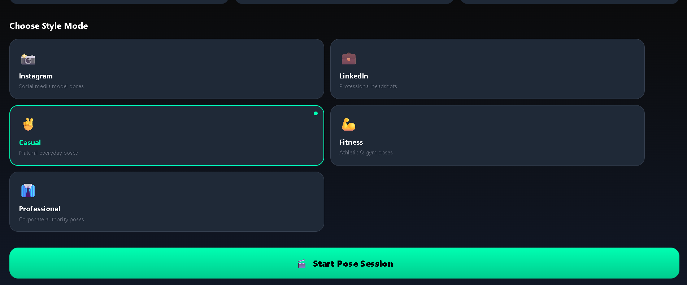

# 🕺 AI Pose Transformation & Real-Time Guidance



## 🌟 Overview

**AI Pose Transformation** is a cutting-edge, real-time photography assistant that bridges the gap between amateur snapshots and professional-grade compositions. Unlike traditional post-processing apps, this platform acts as a **Live Coach**, providing immediate visual feedback and skeletal overlays to help users achieve the perfect pose, lighting, and frame before the shutter even clicks.

By leveraging **Mediapipe** for high-fidelity pose estimation and **FastAPI** for low-latency AI analysis, the system offers a seamless bridge between mobile hardware and intelligent cloud/local processing.

---

## 🎯 The Problem & The Solution

### ❌ The Problem: "The Awkward Pose Syndrome"
Most people struggle with "camera shyness" or "awkward posing" because they don't know what to do with their hands, how to stand, or what angle looks best. Traditional photography apps only offer filters **after** the photo is taken, but they don't solve the core issue: **The subject's lack of confidence and guidance during the shoot.**

- **Retake Fatigue:** Taking 50 photos just to get one decent one.
- **Static Inspiration:** Looking at a pose on Pinterest but not being able to replicate it in real life.
- **Communication Gap:** Difficulty for photographers to explain exact limb positions to their subjects.

### ✅ The Solution: AI-Powered "Live Coaching"
This project transforms the smartphone from a passive capture device into an **active director**.

- **Instant Correction:** No more guessing. The AI tells you to "Raise your left arm" or "Tilt your head" in real-time.
- **Skeletal Alignment:** By projecting a "Ghost Skeleton" on the screen, users can physically match their joints to a professional pose.
- **Dynamic Confidence:** Real-time scoring gives the user immediate validation, boosting their confidence and resulting in more natural-looking photos.
- **Efficient Workflow:** Get the "perfect shot" in the first 3 tries, saving storage and time.

---

## 🚀 Key Features

### 📡 1. Real-Time Guidance
The system operates at **10+ FPS**, providing immediate visual instructions on how to stand, sit, or position your limbs. It doesn't just "fix" a photo; it guides the subject into the perfect form.

### 🧠 2. Scene-Aware AI
Moving beyond generic suggestions, the AI analyzes the user's selected style (e.g., *Instagram, LinkedIn, Fitness*) and environmental context to suggest appropriate, creative poses that feel natural and aesthetically pleasing.

### 🖼️ 3. Visual Ghost Overlays
Follow on-screen "Ghost Outlines" to match professional poses. The UI renders a transparent skeletal guide provided by the backend, making it incredibly easy for users to align themselves perfectly.

### 📸 4. Proactive Photography
The app shifts the focus from "Retaking" to "Perfecting." With a live **Posture Score**, it tells you exactly when you've hit the mark, ensuring every shot is a keeper.

---

## 🛠️ Tech Stack

### Backend
- **FastAPI**: High-performance Python framework for the API and WebSockets.
- **Mediapipe**: Google's industry-standard library for Pose and Landmark detection.
- **SQLAlchemy + MySQL**: Robust data persistence for user history and session analytics.
- **NumPy**: For complex geometric calculations and pose similarity scoring.

### Frontend
- **React Native (Expo)**: Cross-platform mobile development.
- **Zustand**: Lightweight and scalable state management.
- **React Native SVG**: For high-performance, real-time skeletal overlays.
- **Axios + WebSockets**: Hybrid communication for RESTful data and live binary/JSON streaming.

---

## 📂 Project Structure

```text
ai-pose-transformation/
├── ai-pose-transformation-backend/     # FastAPI Application
│   ├── auth/                           # JWT & User Auth Logic
│   ├── models/                         # SQLAlchemy Database Models
│   ├── routes/                         # API & WebSocket Endpoints
│   ├── services/                       # AI Engine & Pose Logic (Mediapipe)
│   └── main.py                         # Application Entry Point
├── ai-pose-transformation-frontend/    # React Native / Expo App
│   ├── app/                            # Screens & Navigation (Expo Router)
│   ├── components/                     # Real-time Overlays & UI Kits
│   ├── services/                       # API Clients & Zustand Stores
│   └── assets/                         # Static Assets
└── images/                             # Documentation Assets (image.png)
```

---

## 🔧 Installation & Setup

### 1. Backend Setup
```bash
cd ai-pose-transformation-backend
python -m venv .venv
source .venv/bin/activate  # Windows: .venv\Scripts\activate
pip install -r requirements.txt
python main.py
```

### 2. Frontend Setup
```bash
cd ai-pose-transformation-frontend
npm install
npx expo start
```

---

## 🛣️ Roadmap
- [ ] **Dynamic Environment Analysis:** Suggesting poses based on background lighting.
- [ ] **Multi-Person Support:** Group posing guidance.
- [ ] **AR Implementation:** 3D avatar overlays for even better spatial guidance.
- [ ] **Session Replay:** Watch your session back with AI corrections highlighted.

---

## 👤 Author

**Developed by:** Hafiz Muhammad Umar Farooq
- **Role:** Full-Stack Agentic AI Engineer
- **Github:** [@YourGithub](https://github.com/Hafiz-Muhammad-Umar12)
- **LinkedIn:** [Your Name](https://www.linkedin.com/in/muhammad-umar-b70207338/)

---

## 🤝 Contributing
We welcome contributions! Please feel free to submit a Pull Request or open an issue for discussion.

---

## 📜 License
This project is licensed under the MIT License - see the [LICENSE](LICENSE) file for details.

---
*Developed with ❤️ for the future of photography.*
