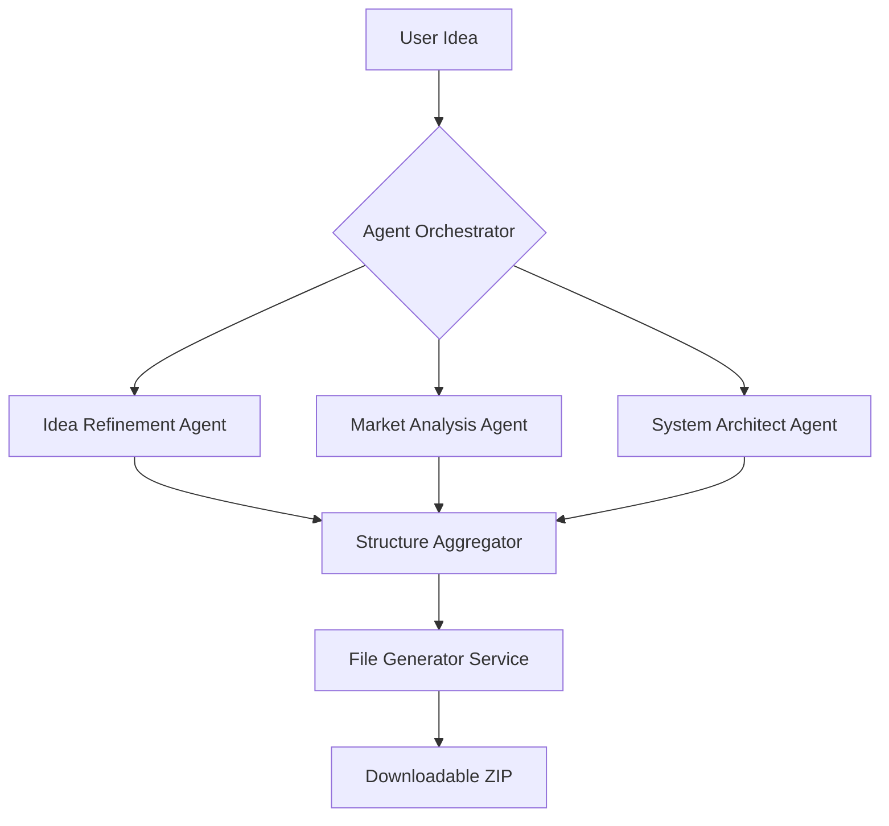

# 🚀 AI Startup Builder
### *The Intelligent Factory for the Next Generation of Startups.*

[](https://nextjs.org/)
[](https://fastapi.tiangolo.com/)
[](https://www.postgresql.org/)
[](https://github.com/features/copilot)

**AI Startup Builder** is a sophisticated, agentic AI-powered SaaS platform that transforms a simple idea into a fully functional, production-ready full-stack codebase. Using a distributed multi-agent architecture, it validates concepts, generates technical blueprints, and scaffolds entire projects—all within minutes.

---

## ✨ Key Features

- **🤖 Multi-Agent Orchestration**: Specialized AI agents (Market, Tech, and Idea agents) work in parallel to validate and build your startup.
- **🛠️ Full-Stack Code Generation**: Generates a complete directory structure including frontend, backend, and database migrations.
- **🔐 Secure Authentication**: Full user lifecycle management with persistent sessions and protected routes.
- **⚡ Real-time Pipeline**: Visualize the AI's thought process through a dynamic pipeline visualizer powered by Framer Motion.
- **📦 Instant Export**: Download your generated startup as a clean, structured ZIP file ready for deployment.
- **📈 Project Tracking**: A comprehensive dashboard to manage, track, and revisit your generated startup ideas.

---

## 🏗️ The Agentic Architecture

The system operates on a **Distributed Task-Oriented Architecture**, ensuring high availability and responsiveness even during heavy AI computations.



---

## 🛠️ Tech Stack

### **Frontend**
- **Framework**: Next.js 14 (App Router)
- **Styling**: TailwindCSS (Modern, responsive design)
- **Animations**: Framer Motion (Smooth, interactive UI)
- **State Management**: React Context API

### **Backend**
- **API**: FastAPI (High-performance Python framework)
- **Task Queue**: Celery-like asynchronous pipeline
- **ORM**: SQLAlchemy (Async)
- **Database**: PostgreSQL (Hosted on Neon DB)

### **AI Layer**
- **Orchestration**: Custom Agentic Workflow
- **Models**: Advanced LLM integration for business logic and code generation

---

## 📂 Project Structure

```text
ai-startup-builder/
├── backend/                # FastAPI Application
│   ├── agents/            # AI Agent Logic (Idea, Market, Tech)
│   ├── api/               # API Endpoints (Auth, Projects)
│   ├── core/              # Config, LLM, & Memory settings
│   ├── db/                # Models & Schemas
│   ├── workers/           # Background Task Processing
│   └── main.py            # Entry point
├── frontend/               # Next.js Application
│   ├── app/               # App Router (Pages & Layouts)
│   ├── components/        # Reusable UI components
│   ├── context/           # Auth & Global State
│   └── lib/               # API & Utility functions
└── migrations/             # Alembic Database Migrations
```

---

## 🚀 Getting Started

### 1. Backend Setup
```bash
# Navigate to backend
cd backend

# Create & configure environment
cp .env.example .env

# Install dependencies using 'uv' or 'pip'
uv sync 

# Run database migrations
python scripts/setup_db.py

# Start the development server
uvicorn main:app --reload
```

### 2. Frontend Setup
```bash
# Navigate to frontend
cd frontend

# Install dependencies
npm install

# Start the Next.js dev server
npm run dev
```

---

## 🔮 Future Roadmap

- [ ] **Custom Templates**: Allow users to choose specific tech stacks (MERN, T3, etc.).
- [ ] **Live Preview**: Integrated IDE for viewing code directly in the browser.
- [ ] **One-Click Deploy**: Deploy generated apps directly to Vercel/Railway.
- [ ] **Collaborative Mode**: Invite team members to refine the generated ideas.

---

## 👤 Author

**Hafiz Muhammad Umar Farooq**
---
*Built with ❤️ for the future of entrepreneurship.*
