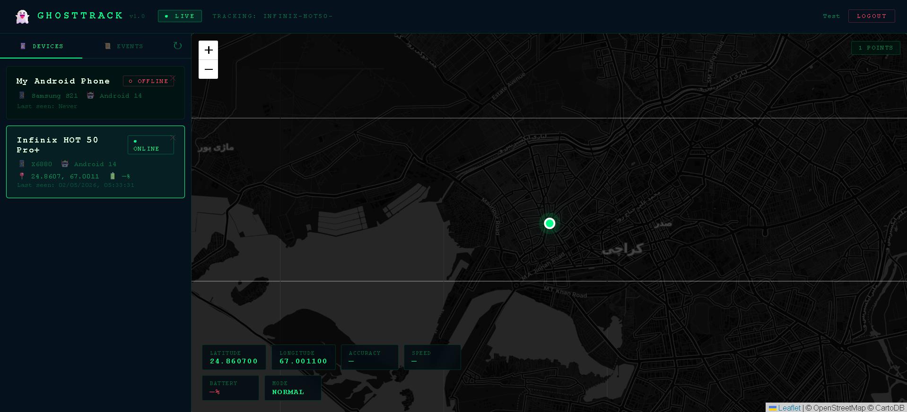
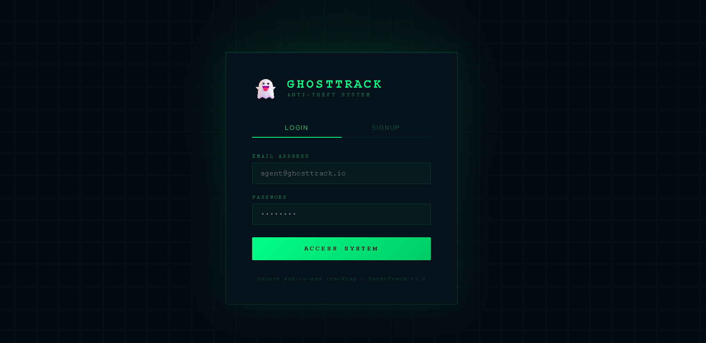

# 👻 GhostTrack AI — Real-Time Anti-Theft Tracking System

GhostTrack is a full-stack, real-time vehicle/device tracking system designed with **security and anti-theft** in mind. It goes beyond simple GPS tracking by implementing features like boot-event reporting, fake-shutdown detection, and low-latency WebSocket updates.

---

## 🚀 Overview

The system consists of a high-performance **FastAPI backend** and a tactical **React.js dashboard**. It is designed to receive location pings from mobile devices (acting as trackers) and broadcast them instantly to authorized web clients via WebSockets.

### 🛡️ Key Anti-Theft Features
- **Live Tracking:** Sub-second updates on a tactical dark-mode map.
- **Fake-Shutdown Detection:** Specifically designed to catch thieves trying to "turn off" the device.
- **Boot Reporting:** Automatic location ping as soon as the device is powered on.
- **Aggressive Tracking Mode:** High-frequency updates triggered by security events.
- **Historical Trails:** Visual polyline paths of where the device has been.

---

## 📸 Screenshots

### **1. Tactical Dashboard**

*Real-time map tracking with live movement trails and device status.*

### **2. Secure Login**

*JWT-protected authentication for authorized access.*

---

## 🛠️ Tech Stack

### **Backend (The Engine)**
- **Framework:** [FastAPI](https://fastapi.tiangolo.com/) (Python)
- **Database:** [SQLAlchemy](https://www.sqlalchemy.org/) (SQLite for Dev, PostgreSQL ready)
- **Real-time:** [WebSockets](https://developer.mozilla.org/en-US/docs/Web/API/WebSockets_API)
- **Security:** JWT (JSON Web Tokens) with OAuth2 Password Flow & Bcrypt hashing.
- **Validation:** Pydantic models.

### **Frontend (The Dashboard)**
- **Framework:** [React.js](https://react.dev/)
- **Mapping:** [Leaflet.js](https://leafletjs.com/) with [React-Leaflet](https://react-leaflet.js.org/)
- **Styling:** Custom Vanilla CSS (Tactical Dark Theme)
- **Communication:** Axios (REST API) & Native WebSockets.
- **Date Handling:** Date-fns for human-readable timestamps.

---

## 📂 Project Structure

```text
ghost-tracker-ai/
├── backend/                # FastAPI Application
│   ├── app/
│   │   ├── api/            # Route handlers (Auth, Device, Location)
│   │   ├── core/           # Security, Websockets, Config
│   │   ├── models/         # Database Schemas (SQLAlchemy)
│   │   ├── schemas/        # Request/Response Validation (Pydantic)
│   │   └── services/       # Business Logic (Location processing)
│   └── requirements.txt    # Python Dependencies
│
└── frontend/               # React Dashboard
    ├── src/
    │   ├── components/     # UI Elements (MapView, DeviceCards)
    │   ├── context/        # Global Auth State
    │   ├── pages/          # Dashboard & Login Views
    │   ├── services/       # API abstraction (Axios)
    │   └── socket/         # WebSocket singleton manager
    └── package.json        # JS Dependencies
```

---

## 📡 System Architecture

1.  **Mobile Client (Tracker):** Sends GPS coordinates via POST requests to `/location/update`.
2.  **FastAPI Backend:**
    - Validates the device and saves coordinates to the database.
    - Identifies if the event is a `boot`, `shutdown`, or `standard update`.
    - Broadcasts the update to all active WebSockets connected to that `device_id`.
3.  **Web Dashboard:**
    - Authenticates via JWT.
    - Connects to the WebSocket.
    - Updates the map marker and stats overlay in real-time without refreshing.

---

## ⚙️ Quick Start

### 1. Backend Setup
```bash
cd backend
pip install -r requirements.txt
cp .env.example .env
uvicorn app.main:app --reload
```

### 2. Frontend Setup
```bash
cd frontend
npm install
npm start
```

---

## 🛡️ API Reference (Summary)

| Endpoint | Method | Description |
| :--- | :--- | :--- |
| `/auth/login` | `POST` | Get JWT access token |
| `/device/register` | `POST` | Register a new tracking device |
| `/location/update` | `POST` | Push GPS data (lat, lng, battery, event_type) |
| `/ws/location/{id}` | `WS` | Real-time WebSocket stream for a device |

---

## 📝 Roadmap
- [ ] Mobile App (React Native/Flutter) integration.
- [ ] Geofencing alerts (SMS/Email).
- [ ] Remote device lock command via WebSocket.
- [ ] Advanced battery analytics.

---
*Created by [Your Name/Team] — Tactical Security Solutions.*
