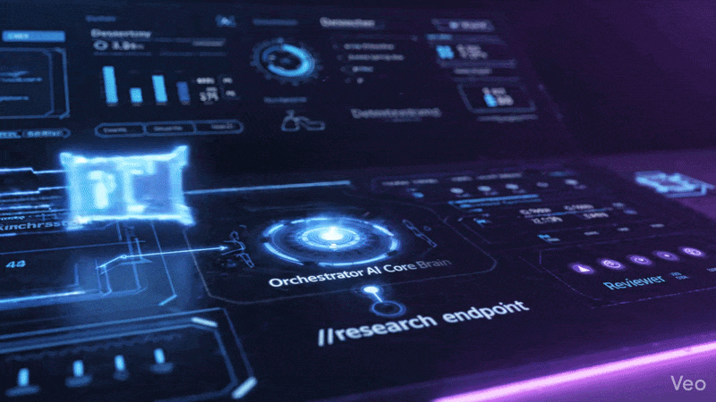

# 🧠 Multi-Agent Research System

A **hybrid AI research automation system** that combines a lightweight single-call LLM orchestration mode with a modular multi-agent architecture design for scalable autonomous research generation.

---

## 🎥 Live Demo




## 🚀 Overview

The **Multi-Agent Research System** is an AI-powered framework that generates structured research reports using an orchestrated workflow. It is designed as an **evolutionary architecture**:

* 🟢 **Active Mode (MVP / Free Tier Optimized)** → Single LLM call using a mega-prompt orchestrator
* 🔵 **Planned Mode (Advanced Multi-Agent System)** → Fully modular agent-based pipeline

This design allows fast production usage today while enabling scalable agentic intelligence in the future.

---

## ⚙️ System Architecture

### 🟢 Active Flow (Current Production Mode)

This is the live, optimized pipeline used in production:

```
Client Request (/research)
        ↓
routes.py (API Layer)
        ↓
research_flow.py (Orchestrator)
        ↓
orchestrator.py (Mega Prompt Builder)
        ↓
Gemini LLM (Single Call Execution)
        ↓
Structured Research Output
        ↓
reports/output.md
```

### 🧠 How it works

1. API receives a research request (`/research` endpoint)
2. Orchestrator builds a **single comprehensive prompt**
3. Prompt simulates multiple roles:

   * Planner 🧭
   * Researcher 🔎
   * Writer ✍️
   * Reviewer ✅
4. Gemini returns a complete structured report in one response
5. Output is saved in Markdown format (`output.md`)

---

## 🧩 Modular Agent Architecture (Future System)

The codebase already includes a fully modular agent design for future scaling:

```
Planner → Researcher → Web Agent → Summarizer → Writer → Reviewer
```

### 🧠 Agent Responsibilities

* 🧭 **Planner (planner.py)** → Breaks topic into sub-tasks
* 🔎 **Researcher (researcher.py)** → Collects domain knowledge
* 🌐 **Web Agent (web_agent.py)** → Fetches real-time data
* ✂️ **Summarizer (summarizer.py)** → Condenses information
* ✍️ **Writer (writer.py)** → Generates structured report
* ✅ **Reviewer (reviewer.py)** → Validates quality & coherence

> ⚠️ Currently these agents exist structurally but are not fully chained in execution flow.

---

## 🔧 Tools & External Integrations

### 🔍 Search Tool

* `search_tool.py` currently uses **mock data responses**
* Can be upgraded to:

  * Serper API
  * Tavily Search API
  * DuckDuckGo API

---

### 🧠 Memory System

Located in `memory/`:

* 🗄️ PostgreSQL → Structured storage
* 🧲 Qdrant Vector DB → Semantic retrieval

Used for:

* Long-term research memory
* Context-aware querying
* Knowledge persistence

---

## 🏗️ Project Structure

```
multi-agent-research-system/
│
├── backend/
│   ├── routes.py
│   ├── research_flow.py
│   ├── orchestrator.py
│   │
│   ├── agents/
│   │   ├── planner.py
│   │   ├── researcher.py
│   │   ├── web_agent.py
│   │   ├── summarizer.py
│   │   ├── writer.py
│   │   └── reviewer.py
│   │
│   ├── tools/
│   │   └── search_tool.py
│   │
│   ├── memory/
│   │   ├── postgres_client.py
│   │   └── qdrant_client.py
│   │
│   └── reports/
│       └── output.md
│
└── README.md
```

---

## 🧪 Example Workflow

### Input:

```
"Analyze the future of AI agents in 2026"
```

### Execution Flow:

1. Request hits `/research`
2. Orchestrator builds structured mega-prompt
3. Gemini simulates multi-agent reasoning
4. Output includes:

   * Plan
   * Research insights
   * Structured analysis
   * Final report

---

## 🔥 Key Features

* ⚡ Fast single-call LLM execution (optimized for cost)
* 🧠 Multi-agent design ready (scalable architecture)
* 📄 Markdown report generation
* 🧩 Modular backend design
* 🧠 Memory + vector DB integration ready
* 🔌 Pluggable search tools

---

## 🚧 Current Limitations

* Agents are not yet fully executed as independent runtime processes
* Search tool uses mock data
* No real-time agent communication system yet
* Single LLM call limits deep reasoning traceability

---

## 🔮 Future Roadmap

* 🧠 True multi-agent orchestration (event-driven pipeline)
* 🔄 LangGraph-style execution flow
* 🌐 Real-time web search integration
* 🧩 Tool-calling based agents
* 📡 Agent communication system
* 🧠 Persistent long-term memory layer
* 🎤 Voice-enabled research queries

---


## 👨‍💻 Author

**Muhammad Umar**
Agentic AI Developer | Full Stack Engineer

---

## ⭐ Support

If you like this project, please consider giving it a ⭐ on GitHub. It helps improve and expand the system further
