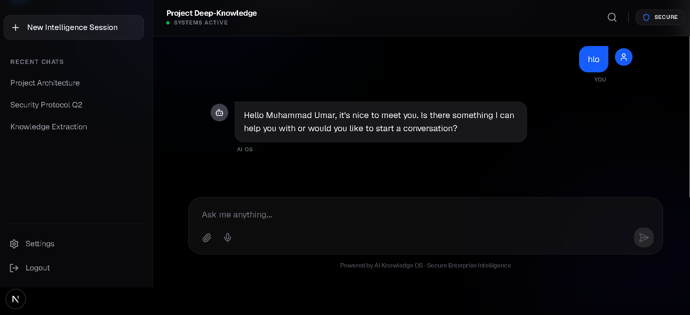
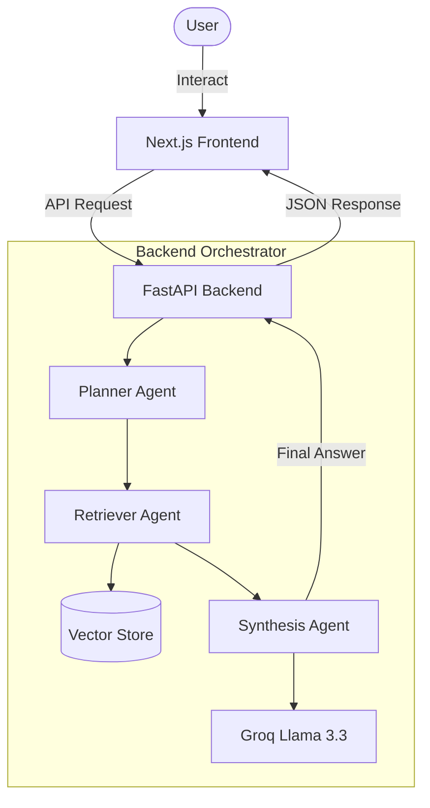

# 🧠 AI Knowledge OS: Enterprise Intelligence Platform

[](https://nextjs.org/)
[](https://fastapi.tiangolo.com/)
[](https://tailwindcss.com/)
[](https://groq.com/)

An advanced, multi-agent AI ecosystem designed for enterprise-grade knowledge retrieval, document analysis, and secure intelligence orchestration.



## 🚀 Key Features

- **Multi-Agent Orchestration**: Seamlessly coordinates between Planner, Retriever, and Synthesis agents.
- **RAG Integration**: Advanced Retrieval-Augmented Generation for context-aware responses.
- **Pro UI/UX**: Modern, glassmorphic interface built with Framer Motion and Lucide.
- **Secure Persistence**: Integrated vector memory store for long-term context retention.
- **High Performance**: Powered by Groq's Llama-3.3-70b for sub-second inference.

---

## 🏗️ System Architecture



---

## 📂 Project Structure

```text
D:\personal-ai-knowledge-os\
├── backend/                # FastAPI Application
│   ├── app/
│   │   ├── agents/         # Intelligence Core (Planner, Synthesis, etc.)
│   │   ├── api/            # API Routes & Endpoints
│   │   ├── core/           # Config, Security, Logger
│   │   ├── memory/         # Vector Database & Retrieval Logic
│   │   └── services/       # Business Logic & Orchestration
│   └── tests/              # Pytest Suite
├── frontend/               # Next.js Application (App Router)
│   ├── app/                # Main Pages & Layouts
│   ├── components/         # Professional UI Components
│   ├── lib/                # API Clients & Utilities
│   └── public/             # Static Assets
└── scripts/                # Database setup & Ingestion tools
```

---

## 🛠️ Tech Stack

| Layer | Technology |
| :--- | :--- |
| **Frontend** | React 19, Next.js 15, Tailwind CSS 4, Framer Motion |
| **Backend** | Python 3.10+, FastAPI, Pydantic v2 |
| **AI/LLM** | Groq SDK (Llama 3.3 70b), LangChain/Custom Agents |
| **Database** | Qdrant (Vector Store) |
| **Icons** | Lucide React |

---

## ⚡ Quick Start

### Backend Setup
1. **Navigate to backend**:
   ```bash
   cd backend
   ```
2. **Install Dependencies**:
   ```bash
   pip install -r requirements.txt
   ```
3. **Configure Environment**:
   Create a `.env` file:
   ```env
   GROQ_API_KEY=your_key_here
   DATABASE_URL=your_qdrant_url
   ```
4. **Run Server**:
   ```bash
   uvicorn app.main:app --reload
   ```

### Frontend Setup
1. **Navigate to frontend**:
   ```bash
   cd frontend
   ```
2. **Install Packages**:
   ```bash
   npm install
   ```
3. **Start Development**:
   ```bash
   npm run dev
   ```

---

## 🤝 Workflow
1. **Input Analysis**: Planner agent identifies user intent and required tools.
2. **Knowledge Retrieval**: Retriever fetches relevant context from the vector store.
3. **Synthesis**: Synthesis agent combines context + intent to generate a professional response.
4. **Memory Injection**: The interaction is stored back into the long-term memory.

## 🛡️ Security & Performance
- **Enterprise-ready**: Designed for isolated session handling.
- **Latency-optimized**: Minimal overhead between agent transitions.
- **Fully Typed**: End-to-end TypeScript and Pydantic validation.

---

<p align="center">
  Developed with ❤️ for the AI Knowledge Ecosystem
</p>
